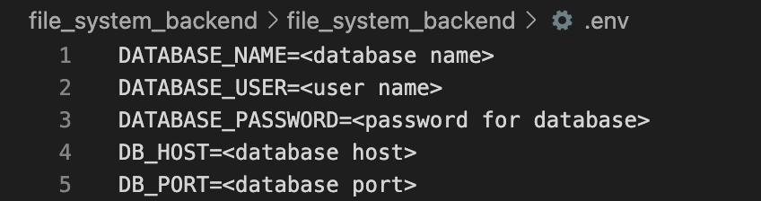

# file_system

# file system backend

1. Install postgreSQL from https://www.postgresql.org/download/

2. Add `PostgreSQL/[version, either 12 or 13]/bin` and `PostgreSQL/[version, either 12 or 13]/lib` to PATH (on Windows) or make it an environment variable on Mac/Linux.

- To make environment variable use the following command
```
export POSTGRES_HOME=/Applications/Postgres.app/Contents/Versions/latest
export PATH=$POSTGRES_HOME/bin:$PATH
```

- Confirm installation
```
psql --version
```

3. Setup your local POSTGRES database.
- You can use the following to guide on how you can setup your local POSTGRES DV: https://medium.com/@rudipy/how-to-connecting-postgresql-with-a-django-application-f479dc949a11 

4. Connect local POSTGRES database to Django application.
- Navigate to `./file_system_backend/file_system_backend/` directory and add a .env file with the following environment variables:


5. Install dependencies.
- Navigate to `./file_system_backend/` directory and run the following command
```
pip install -r requirements.txt
```

6. Apply migrations to your local DB.
- Navigate to `./simulator_backend/ directory` and run the following command:
```
python manage.py migrate
```

7. Run server.
```
python manage.py runserver
```

8. You can now interact with our API by making the appropriate API calls.
- Checkout this [link](https://docs.google.com/document/d/1fG_gXxn6YWU54vWo3KuIHg9FzdicbvA-nzNCzVuMgYA/edit?usp=sharing) for API documentation.

# If you run into errors with Postgres, it will be helpful to drop the Postgres database and start from scratch:
1. Login as a postgres superuser with the following command and type in the superuser's password(created when you first installed Postgres) when prompted.
```
psql --u postgres
```

2. Drop simulator_backend database and create it again.
```
DROP DATABASE <database name>;
CREATE DATABASE <database name>;
```

3. Grant all privileges to your postgres user.
```
GRANT ALL PRIVILEGES ON DATABASE <database name> TO <username>;
```

4. Exit postgres command line.
```
\q
```

5. Continue from Step 6 above(Apply migrations to your local DB).

# file system frontend